# Laser game


Jeu de destruction de cible par laser. On tire avec un laser dans un terrain, le rayon est dévié avec des miroirs placés au préalable par le joueur pour éviter que le laser casse les murs et pour qu’il atteigne la cible.

#### Installation

Il suffit d'ajouter les fichiers dans un projet Code::Blocks et de compiler. Attention, il faut ajouter seulement les fichiers dont le nom ne commence pas par "test".

#### Structure du projet

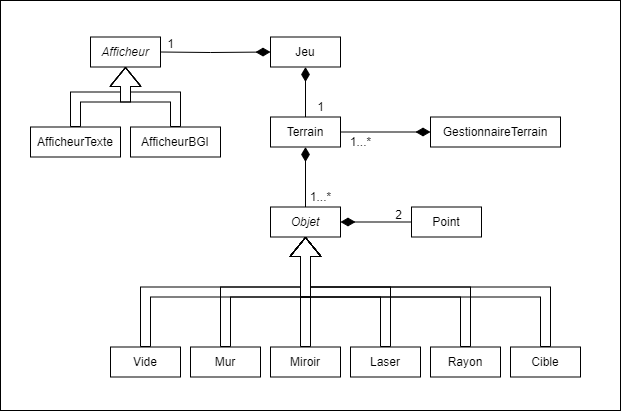

On peut brancher simplement des nouvelles façons d'afficher le jeu en créant une nouvelle classe héritant de `Afficheur` et en implémentant les méthodes virtuelles pures.

De même pour les objets dans le jeu, il suffit de créer une nouvelle classe héritant de `Objet` et en implémentant les méthodes virtuelles pures.

#### Démonstration

Menu du jeu : <br />
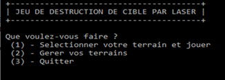

Jeu (Headless) :
| 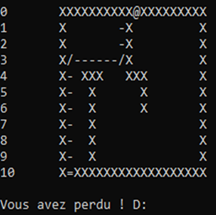 | 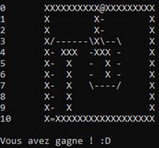 |
|:---:|:---:|

Jeu (Graphique) :
| 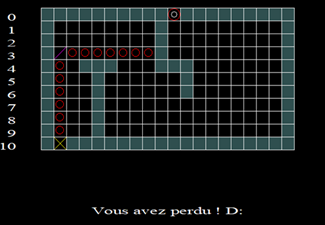 | 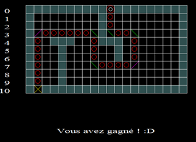 |
|:---:|:---:|

#### Création de terrain

Les terrains sont stockés dans un fichier JSON. Un mur est représenté par un `X`, un laser par un `=` et la cible par un `@`. Les espaces sont des cases vides.

```json
{
    "NbColonnes": 5,
    "NbLignes": 5,
    "Terrain": [
        ["X","X","@","X","X"],
        ["X"," "," "," ","X"],
        ["="," "," "," ","X"],
        ["X"," "," "," ","X"],
        ["X","X","X","X","X"]
    ]
}
```

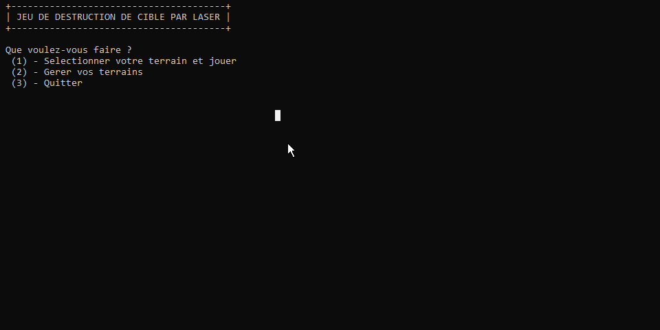

Le terrain créé est ensuite sauvegardé dans un fichier JSON.

```json
{
    "NbColonnes": 10,
    "NbLignes": 10,
    "Terrain": [
        ["X","X","X","X","X","=","X","X","X","X"],
        ["X"," "," "," "," "," "," "," "," ","X"],
        ["X"," "," "," "," "," "," "," "," ","X"],
        ["X"," "," "," "," "," "," "," "," ","X"],
        ["X"," "," "," "," "," "," "," "," ","X"],
        ["X"," "," "," "," ","X"," "," "," ","@"],
        ["X"," "," "," "," "," "," "," "," ","X"],
        ["X"," "," "," "," "," "," "," "," ","X"],
        ["X"," "," "," "," "," "," "," "," ","X"],
        ["X","X","X","X","X","X","X","X","X","X"]
    ]
}
```

#### Exemple de terrain

| 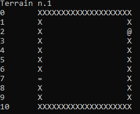 | 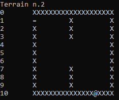 | 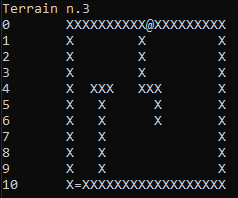 |
|:---:|:---:|:---:|

#### Tests unitaires

Les tests unitaires sont réalisés avec la bibliothèque [doctest](https://github.com/doctest/doctest). Les fichiers de tests portent le nom `test*.cpp`.

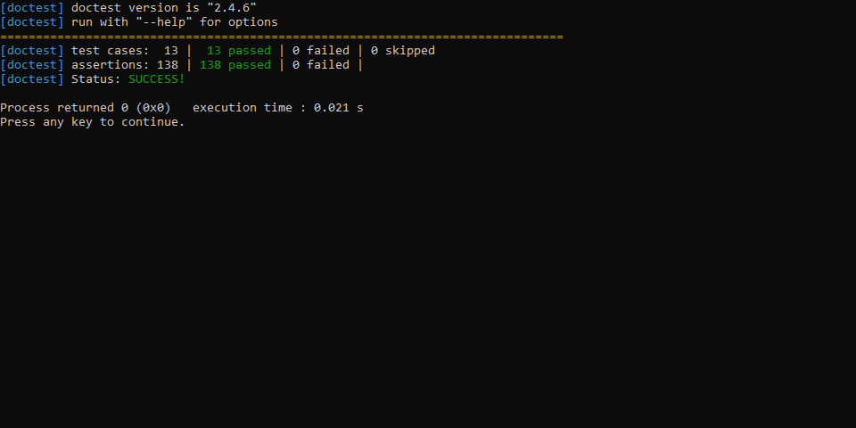

## Auteurs

- GEILLER Valentin, Université de Haute Alsace, L3 Informatique
- DEMBELE Marieme, Université de Haute Alsace, L3 Miage
- DIALLO Mouhamed, Université de Haute Alsace, L3 Miage